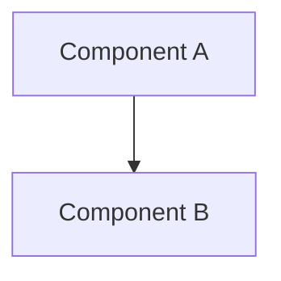

# Plan: {{PROJECT_NAME}}

## Architecture
(Describe system architecture - how components interact. Use mermaid diagram if helpful:

Or describe in text if simpler.)

## Components
(List major components with their responsibilities)
- **(Component 1 name)**: (What it does and why it's needed)
- **(Component 2 name)**: (What it does and why it's needed)
- **(Component 3 name)**: (What it does and why it's needed)

## Tech Stack
(Specify technology choices with brief rationale)
- **Frontend**: (Technology and why - e.g., "React for component reusability")
- **Backend**: (Technology and why - e.g., "Node.js for async I/O")
- **Database**: (Technology and why - e.g., "PostgreSQL for relational data")

## Integration Points
(Define how components/systems integrate)
- (Integration 1: How Component A talks to Component B)
- (Integration 2: How system integrates with external APIs)

## Key Decisions
(Document important technical decisions and rationale)
| Decision | Rationale |
|----------|-----------|
| (Decision 1: e.g., "Use REST over GraphQL") | (Why: e.g., "Simpler for this use case") |
| (Decision 2: e.g., "Monorepo structure") | (Why: e.g., "Easier code sharing") |
