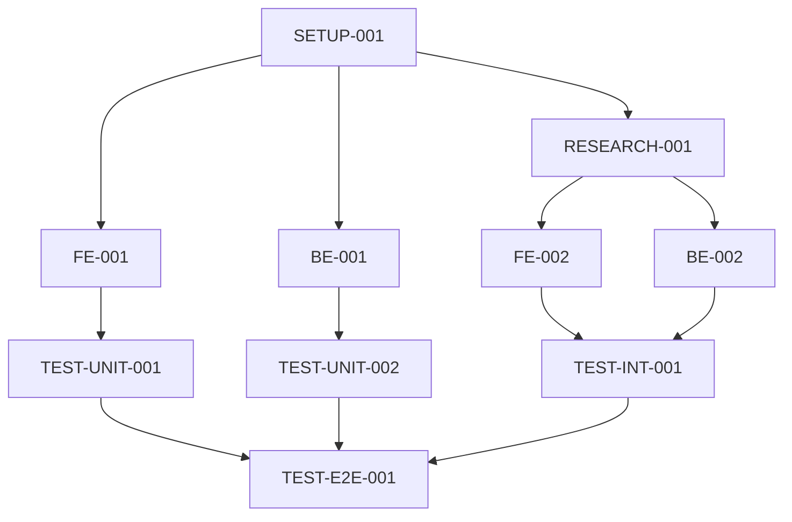

# Task Breakdown Template

## Project Information

**Project**: [Project Name]
**Sprint/Iteration**: [Sprint/Iteration Name]
**Created**: [Creation Date]
**Last Updated**: [Last Updated Date]

## Task Categories

### 🏗️ Foundation & Setup
- [ ] **SETUP-001**: Project initialization and environment setup
  - **Priority**: High
  - **Assignee**: [Responsible Person]
  - **Dependencies**: None
  - **Complexity**: Medium
  - **Acceptance Criteria**:
    - [ ] Development environment configured
    - [ ] Basic project structure created
    - [ ] Necessary tools and dependencies installed

### 🔍 Research & Analysis
- [ ] **RESEARCH-001**: Technical research and proof of concept
  - **Priority**: High
  - **Assignee**: [Responsible Person]
  - **Dependencies**: SETUP-001
  - **Complexity**: High
  - **Acceptance Criteria**:
    - [ ] Technical solution feasibility verified
    - [ ] Proof of concept code completed
    - [ ] Technical risk assessment documented

### 💻 Core Development
#### Frontend Tasks
- [ ] **FE-001**: [Frontend task description]
  - **Priority**: [High/Medium/Low]
  - **Assignee**: [Responsible Person]
  - **Dependencies**: [Dependent tasks]
  - **Complexity**: [Low/Medium/High]
  - **Acceptance Criteria**:
    - [ ] [Acceptance criteria 1]
    - [ ] [Acceptance criteria 2]
  - **Definition of Done**:
    - [ ] Code review completed
    - [ ] Unit tests passing
    - [ ] Integration tests passing

#### Backend Tasks
- [ ] **BE-001**: [Backend task description]
  - **Priority**: [High/Medium/Low]
  - **Assignee**: [Responsible Person]
  - **Dependencies**: [Dependent tasks]
  - **Complexity**: [Low/Medium/High]
  - **Acceptance Criteria**:
    - [ ] [Acceptance criteria 1]
    - [ ] [Acceptance criteria 2]
  - **Definition of Done**:
    - [ ] API documentation updated
    - [ ] Performance tests passing
    - [ ] Security checks passing

#### Database Tasks
- [ ] **DB-001**: [Database-related task description]
  - **Priority**: [High/Medium/Low]
  - **Assignee**: [Responsible Person]
  - **Dependencies**: [Dependent tasks]
  - **Complexity**: [Low/Medium/High]
  - **Acceptance Criteria**:
    - [ ] Database migration scripts completed
    - [ ] Data validation tests passing

### 🧪 Testing & Quality Assurance
#### Unit Tests
- [ ] **TEST-UNIT-001**: [Unit testing task]
  - **Priority**: Medium
  - **Assignee**: [Responsible Person]
  - **Dependencies**: [Related development tasks]
  - **Complexity**: [Low/Medium/High]
  - **Acceptance Criteria**:
    - [ ] Test coverage > 80%
    - [ ] All test cases passing

#### Integration Tests
- [ ] **TEST-INT-001**: [Integration testing task]
  - **Priority**: Medium
  - **Assignee**: [Responsible Person]
  - **Dependencies**: [Related development tasks]
  - **Complexity**: [Low/Medium/High]
  - **Acceptance Criteria**:
    - [ ] API integration tests passing
    - [ ] Database integration tests passing

#### End-to-End Tests
- [ ] **TEST-E2E-001**: [End-to-end testing task]
  - **Priority**: Medium
  - **Assignee**: [Responsible Person]
  - **Dependencies**: [All core functionality completed]
  - **Complexity**: [Low/Medium/High]
  - **Acceptance Criteria**:
    - [ ] Key user workflow tests passing
    - [ ] Browser compatibility tests passing

### 🔧 DevOps & Infrastructure
- [ ] **DEVOPS-001**: [DevOps task description]
  - **Priority**: Medium
  - **Assignee**: [Responsible Person]
  - **Dependencies**: [Dependent tasks]
  - **Complexity**: [Low/Medium/High]
  - **Acceptance Criteria**:
    - [ ] CI/CD pipeline configured
    - [ ] Deployment scripts tested

### 📚 Documentation
- [ ] **DOC-001**: [Documentation task description]
  - **Priority**: Low
  - **Assignee**: [Responsible Person]
  - **Dependencies**: [Related functionality completed]
  - **Complexity**: [Low/Medium/High]
  - **Acceptance Criteria**:
    - [ ] API documentation updated
    - [ ] User guide completed

## Task Dependencies

## Sprint Plan

### Sprint 1: Foundation
**Goal**: [Sprint goal]

#### Sprint Backlog
- [ ] SETUP-001
- [ ] RESEARCH-001
- [ ] FE-001 (Partial)
- [ ] BE-001 (Partial)

#### Definition of Done for Sprint
- [ ] All planned tasks completed
- [ ] Code review passed
- [ ] Tests written and passing
- [ ] Documentation updated

### Sprint 2: Core Features
**Goal**: [Sprint goal]

#### Sprint Backlog
- [ ] FE-001 (Complete)
- [ ] BE-001 (Complete)
- [ ] FE-002
- [ ] BE-002
- [ ] DB-001

### Sprint 3: Integration & Testing
**Goal**: [Sprint goal]

#### Sprint Backlog
- [ ] TEST-UNIT-001
- [ ] TEST-UNIT-002
- [ ] TEST-INT-001
- [ ] TEST-E2E-001
- [ ] DOC-001

## Risk & Blockers

### Current Blockers
- **Blocker 1**: [Blocker description] - [Owner: responsible person] - [Resolution date]
- **Blocker 2**: [Blocker description] - [Owner: responsible person] - [Resolution date]

### Potential Risks
- **Risk 1**: [Risk description] - [Probability: probability] - [Impact: impact] - [Mitigation: mitigation strategy]
- **Risk 2**: [Risk description] - [Probability: probability] - [Impact: impact] - [Mitigation: mitigation strategy]

## Progress Tracking

### Task Status Summary
| Status | Count | Percentage |
|--------|-------|------------|
| To Do | [number] | [percentage]% |
| In Progress | [number] | [percentage]% |
| In Review | [number] | [percentage]% |
| Done | [number] | [percentage]% |

### Complexity Distribution
| Complexity | Count | Priority |
|------------|-------|----------|
| Low | [number] | Quick wins |
| Medium | [number] | Standard tasks |
| High | [number] | Requires focus |

## Quality Metrics

### Code Quality
- **Code Coverage**: [current coverage]% / [target coverage]%
- **Code Review Pass Rate**: [pass rate]%
- **Bug Density**: [defect density]

### Performance Metrics
- **Build Time**: [build time]
- **Test Execution Time**: [test execution time]
- **Deployment Time**: [deployment time]

## Team Capacity

### Team Members Availability
| Member | Skills | Current Load | Availability |
|--------|--------|--------------|------------|
| [Member 1] | [skills] | [current workload] | [available] |
| [Member 2] | [skills] | [current workload] | [available] |
| [Member 3] | [skills] | [current workload] | [available] |

### Skill Requirements
- **Required Skills**: [required skills list]
- **Current Skills**: [current team skills]
- **Skill Gaps**: [skill gaps]

## Communication & Meetings

### Daily Standup
- **Time**: [time]
- **Attendees**: [attendees]
- **Format**: [meeting format]

### Sprint Review
- **Date**: [date]
- **Attendees**: [attendees]
- **Agenda**: [agenda]

### Retrospective
- **Date**: [date]
- **Attendees**: [attendees]
- **Focus Areas**: [focus areas]

---
**Last Updated**: [update date]
**Next Review**: [next review date]