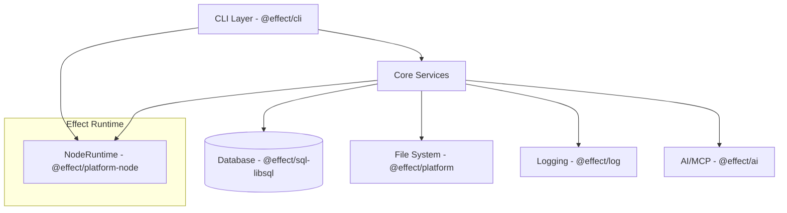

# Plan: effect-ecosystem-migration

## Architecture

The migration will transform the current Sylphx Flow CLI from a Promise-based architecture to an Effect-based functional architecture. The core structure remains similar but all async operations, error handling, and service interactions will use Effect patterns.

## Components

### 1. CLI Layer (@effect/cli)
- **Responsibility**: Replace commander with declarative CLI commands
- **Why**: Type-safe command definitions, automatic help generation, better error handling

### 2. Error System (effect)
- **Responsibility**: Replace custom CLIError with Effect's tagged error system
- **Why**: Better error composition, type-safe error handling, structured error information

### 3. Database Layer (@effect/sql-libsql)
- **Responsibility**: Migrate from @libsql/client to Effect-based SQL client
- **Why**: Type-safe queries, better error handling, composable database operations

### 4. File System (@effect/platform)
- **Responsibility**: Replace Node fs operations with platform abstractions
- **Why**: Cross-platform compatibility, better error handling, testable abstractions

### 5. Logging (@effect/log)
- **Responsibility**: Replace console.log/error with structured logging
- **Why**: Log levels, structured output, better filtering and formatting

### 6. AI/MCP Integration (@effect/ai)
- **Responsibility**: Replace @modelcontextprotocol/sdk with Effect AI patterns
- **Why**: Provider-agnostic AI integration, better error handling, composable AI operations

### 7. Runtime (@effect/platform-node)
- **Responsibility**: Provide Node.js runtime for Effect programs
- **Why**: Proper resource management, error boundaries, platform integration

## Tech Stack

### Core Effect Ecosystem
- **effect**: Core functional effect system and error handling
- **@effect/cli**: Declarative CLI framework with type safety
- **@effect/platform**: Platform abstractions (FileSystem, Path, etc.)
- **@effect/platform-node**: Node.js runtime implementation
- **@effect/log**: Structured logging with levels and filtering
- **@effect/sql-libsql**: Type-safe SQL client for libSQL databases
- **@effect/ai**: Provider-agnostic AI integration layer

### Supporting Libraries
- **@effect/schema**: Runtime type validation and schema definitions
- **drizzle-orm**: Keep existing ORM but integrate with Effect patterns
- **zod**: Keep for schema validation, potentially migrate to @effect/schema

## Integration Points

### CLI to Services Integration
- CLI commands will use Effect.gen to orchestrate service calls
- Services will be provided as Effect Layers for dependency injection
- Error boundaries will catch and display user-friendly errors

### Database Integration
- Database clients will be Effect services provided via Layers
- SQL queries will use tagged template literals for type safety
- Migrations will be Effect programs with proper error handling

### File System Integration
- All file operations will use @effect/platform FileSystem service
- Path operations will use platform-agnostic Path service
- Error handling will distinguish between different file system error types

### AI/MCP Integration
- MCP server will use @effect/ai patterns for tool registration
- AI interactions will be Effect programs with proper error handling
- Provider abstraction will allow switching between AI providers

## Key Decisions

| Decision | Rationale |
|----------|-----------|
| **Complete migration, no backward compatibility** | Simplifies codebase, allows full use of Effect patterns |
| **Keep drizzle-orm** | Mature ORM with good TypeScript support, integrates well with Effect |
| **Use @effect/sql-libsql instead of raw @libsql/client** | Type-safe queries, better error handling, Effect integration |
| **Migrate to @effect/schema gradually** | Start with zod, migrate to @effect/schema for consistency |
| **Use NodeRuntime for CLI execution** | Proper resource management, error boundaries for Node.js environment |
| **Implement services as Effect Layers** | Dependency injection, testability, proper resource lifecycle |
| **Replace all Promise patterns with Effect** | Consistent error handling, better composability, resource safety |

## Migration Strategy

### Phase 1: Foundation
1. Add Effect dependencies
2. Set up basic Effect runtime
3. Create error types and basic logging

### Phase 2: CLI Migration
1. Replace commander with @effect/cli
2. Migrate command handlers to Effect patterns
3. Update error handling in CLI layer

### Phase 3: Database Migration
1. Replace @libsql/client with @effect/sql-libsql
2. Update database clients to use Effect
3. Migrate queries to tagged template literals

### Phase 4: Platform Integration
1. Replace Node fs with @effect/platform
2. Update file operations throughout codebase
3. Migrate path operations

### Phase 5: AI/MCP Migration
1. Replace @modelcontextprotocol/sdk with @effect/ai
2. Update MCP server implementation
3. Migrate tool registrations

### Phase 6: Final Integration
1. Replace remaining Promise patterns
2. Update logging throughout
3. Comprehensive testing and validation