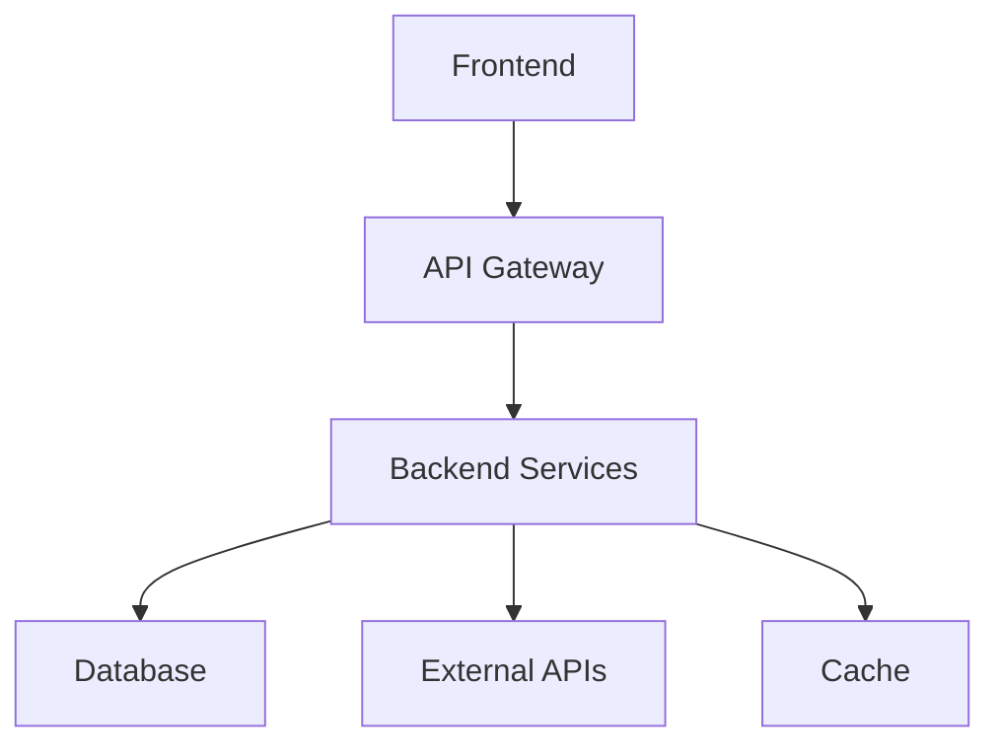

# Implementation Plan: {{PROJECT_NAME}}

{{DESCRIPTION}}

## Architecture Overview
### System Design


### Component Architecture
#### Frontend Components
- **{{FRONTEND_COMP_1}}**: {{FRONTEND_COMP_1_DESC}}
- **{{FRONTEND_COMP_2}}**: {{FRONTEND_COMP_2_DESC}}
- **{{FRONTEND_COMP_3}}**: {{FRONTEND_COMP_3_DESC}}

#### Backend Services
- **{{BACKEND_SVC_1}}**: {{BACKEND_SVC_1_DESC}}
- **{{BACKEND_SVC_2}}**: {{BACKEND_SVC_2_DESC}}
- **{{BACKEND_SVC_3}}**: {{BACKEND_SVC_3_DESC}}

#### Data Layer
- **Primary DB**: {{PRIMARY_DB_DESC}}
- **Cache Layer**: {{CACHE_DESC}}
- **File Storage**: {{STORAGE_DESC}}

## Parallel Execution Strategy

### Phase 2: Parallel Research & Analysis
**Simultaneous Research Streams:**
```
-> {SPECIALIST_1}: {RESEARCH_DOMAIN_1}
-> {SPECIALIST_2}: {RESEARCH_DOMAIN_2}
-> {SPECIALIST_3}: {RESEARCH_DOMAIN_3}
-> {SPECIALIST_4}: {RESEARCH_DOMAIN_4}
-> {SPECIALIST_5}: {RESEARCH_DOMAIN_5}
-> {SPECIALIST_6}: {RESEARCH_DOMAIN_6}

Note: Same specialist can handle multiple domains:
-> analyst: Security requirements analysis
-> analyst: Performance bottleneck analysis
-> architect: System design validation
```

**Synchronization Points:**
- Research findings integration
- Risk assessment consolidation
- Technical constraint validation

### Phase 3: Parallel Design & Planning
**Simultaneous Design Streams:**
```
-> {SPECIALIST_1}: {DESIGN_DOMAIN_1}
-> {SPECIALIST_2}: {DESIGN_DOMAIN_2}
-> {SPECIALIST_3}: {DESIGN_DOMAIN_3}
-> {SPECIALIST_4}: {DESIGN_DOMAIN_4}
-> {SPECIALIST_5}: {DESIGN_DOMAIN_5}
-> {SPECIALIST_6}: {DESIGN_DOMAIN_6}

Note: Same specialist can handle multiple design areas:
-> architect: System architecture design
-> architect: Technology stack validation
-> security: Security architecture design
```

**Integration Coordination:**
- Design alignment checkpoints
- Interface definition synchronization
- Dependency conflict resolution

### Phase 4: Parallel Task Breakdown
**Domain-Specific Task Breakdown:**
```
-> {SPECIALIST_1}: {TASK_BREAKDOWN_DOMAIN_1}
-> {SPECIALIST_2}: {TASK_BREAKDOWN_DOMAIN_2}
-> {SPECIALIST_3}: {TASK_BREAKDOWN_DOMAIN_3}

Note: Same specialist can handle multiple breakdown areas:
-> planner: Dependency mapping
-> planner: Critical path analysis
```

## Implementation Phases

### Phase 6: Parallel Implementation
#### Wave 1: Foundation (Parallel)
- **Infrastructure Setup**: {SPECIALIST_INFRASTRUCTURE}
- **Database Schema**: {SPECIALIST_DATABASE}
- **API Framework**: {SPECIALIST_API}
- **UI Components**: {SPECIALIST_UI}
- **Testing Framework**: {SPECIALIST_TESTING}

Note: Same specialist can handle multiple foundation tasks:
-> devops: Infrastructure setup
-> devops: Testing framework configuration
```

#### Wave 2: Core Features (Parallel)
- **Feature Implementation**: Multiple specialists by domain
- **Integration Development**: Cross-domain coordination
- **Test Development**: Parallel test creation

#### Wave 3: Integration & Quality (Parallel)
- **Integration Testing**: {SPECIALIST_INTEGRATION_TEST}
- **Performance Testing**: {SPECIALIST_PERFORMANCE_TEST}
- **Security Testing**: {SPECIALIST_SECURITY_TEST}

Note: Same specialist can handle multiple test types:
-> tester: Integration testing
-> tester: Security testing
```
- **Documentation**: All specialists

### Phase 7: Parallel Testing & Review
**Simultaneous Testing Streams:**
```
-> {SPECIALIST_1}: {TESTING_DOMAIN_1}
-> {SPECIALIST_2}: {TESTING_DOMAIN_2}
-> {SPECIALIST_3}: {TESTING_DOMAIN_3}
-> {SPECIALIST_4}: {TESTING_DOMAIN_4}
-> {SPECIALIST_5}: {TESTING_DOMAIN_5}
-> {SPECIALIST_6}: {TESTING_DOMAIN_6}

Note: Same specialist can handle multiple testing domains:
-> tester: Functional testing
-> tester: Integration testing
-> security: Security vulnerability scanning
```

### Phase 8: Parallel Cleanup & Refactor
**Simultaneous Cleanup Streams:**
```
-> {SPECIALIST_1}: {CLEANUP_DOMAIN_1}
-> {SPECIALIST_2}: {CLEANUP_DOMAIN_2}
-> {SPECIALIST_3}: {CLEANUP_DOMAIN_3}
-> {SPECIALIST_4}: {CLEANUP_DOMAIN_4}

Note: Same specialist can handle multiple cleanup areas:
-> coder: Code cleanup
-> coder: Performance optimization
-> architect: Architecture validation
```

## Conflict Detection & Management

### Resource Conflicts
#### File Conflicts
- **Risk Areas**: {{FILE_CONFLICT_AREAS}}
- **Resolution Strategy**: {{FILE_CONFLICT_RESOLUTION}}

#### Database Conflicts
- **Risk Areas**: {{DB_CONFLICT_AREAS}}
- **Resolution Strategy**: {{DB_CONFLICT_RESOLUTION}}

#### API Conflicts
- **Risk Areas**: {{API_CONFLICT_AREAS}}
- **Resolution Strategy**: {{API_CONFLICT_RESOLUTION}}

### Timing Conflicts
#### Task Dependencies
- **Critical Path**: {{CRITICAL_PATH}}
- **Dependency Map**: {{DEPENDENCY_MAP}}

#### Integration Points
- **Synchronization Points**: {{SYNC_POINTS}}
- **Coordination Mechanism**: {{COORDINATION_MECHANISM}}

## Technical Decisions

### Architecture Decisions
| Decision | Rationale | Alternatives | Trade-offs |
|----------|-----------|--------------|------------|
| {{ARCH_DECISION_1}} | {{ARCH_DECISION_1_RATIONALE}} | {{ARCH_DECISION_1_ALTERNATIVES}} | {{ARCH_DECISION_1_TRADEOFFS}} |
| {{ARCH_DECISION_2}} | {{ARCH_DECISION_2_RATIONALE}} | {{ARCH_DECISION_2_ALTERNATIVES}} | {{ARCH_DECISION_2_TRADEOFFS}} |

### Technology Choices
- **Frontend**: {{FRONTEND_TECH}} - {{FRONTEND_RATIONALE}}
- **Backend**: {{BACKEND_TECH}} - {{BACKEND_RATIONALE}}
- **Database**: {{DATABASE_TECH}} - {{DATABASE_RATIONALE}}
- **Infrastructure**: {{INFRA_TECH}} - {{INFRA_RATIONALE}}

## Testing Strategy

### Test-Driven Development (TDD)
#### Unit Tests
- **Target Coverage**: {{UNIT_TEST_COVERAGE}}%
- **Framework**: {{UNIT_TEST_FRAMEWORK}}
- **Key Areas**: {{UNIT_TEST_AREAS}}

#### Integration Tests
- **Scope**: {{INTEGRATION_TEST_SCOPE}}
- **Framework**: {{INTEGRATION_TEST_FRAMEWORK}}
- **Test Scenarios**: {{INTEGRATION_TEST_SCENARIOS}}

#### End-to-End Tests
- **Scenarios**: {{E2E_TEST_SCENARIOS}}
- **Framework**: {{E2E_TEST_FRAMEWORK}}
- **Environment**: {{E2E_TEST_ENV}}

### Quality Gates
- **Code Coverage**: >= {{TEST_COVERAGE_TARGET}}%
- **Performance**: < {{PERF_TARGET}}ms response time
- **Security**: No critical vulnerabilities
- **Documentation**: 100% API coverage

## Risk Management

### Failure Scenarios
#### Scenario 1: {{FAILURE_SCENARIO_1}}
- **Trigger**: {{FAILURE_1_TRIGGER}}
- **Impact**: {{FAILURE_1_IMPACT}}
- **Recovery**: {{FAILURE_1_RECOVERY}}
- **Prevention**: {{FAILURE_1_PREVENTION}}

#### Scenario 2: {{FAILURE_SCENARIO_2}}
- **Trigger**: {{FAILURE_2_TRIGGER}}
- **Impact**: {{FAILURE_2_IMPACT}}
- **Recovery**: {{FAILURE_2_RECOVERY}}
- **Prevention**: {{FAILURE_2_PREVENTION}}

## Success Metrics
### Technical Metrics
- **Performance**: {{PERFORMANCE_METRICS}}
- **Reliability**: {{RELIABILITY_METRICS}}
- **Security**: {{SECURITY_METRICS}}
- **Maintainability**: {{MAINTAINABILITY_METRICS}}

### Quality Metrics
- **Code Quality**: {{CODE_QUALITY_METRICS}}
- **Test Coverage**: {{COVERAGE_METRICS}}
- **Documentation**: {{DOC_METRICS}}

---

**Last Updated**: {{LAST_UPDATED}}
**Phase**: 3: PLAN & DESIGN