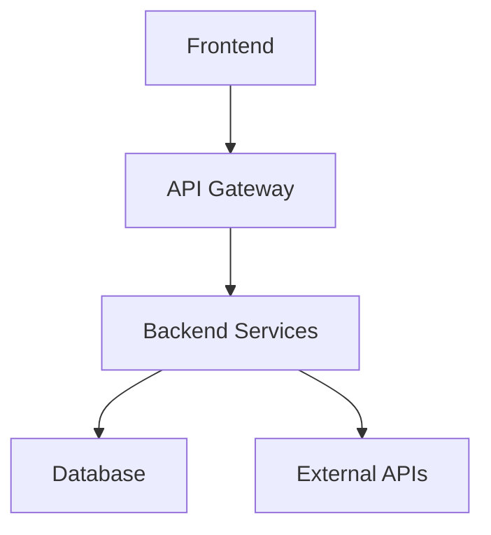

# Implementation Plan: {{PROJECT_NAME}}

{{DESCRIPTION}}

## Overview
This document outlines the implementation approach for {{PROJECT_NAME}}.

## Project Summary
- **Objective**: {{OBJECTIVE}}
- **Scope**: {{SCOPE}}
- **Timeline**: {{TIMELINE}}
- **Budget**: {{BUDGET}}

## Architecture & Design
### System Architecture

### Components
#### {{COMPONENT_1_NAME}}
- **Purpose**: {{COMPONENT_1_PURPOSE}}
- **Technology**: {{COMPONENT_1_TECH}}
- **Dependencies**: {{COMPONENT_1_DEPS}}
- **APIs**: {{COMPONENT_1_APIS}}

#### {{COMPONENT_2_NAME}}
- **Purpose**: {{COMPONENT_2_PURPOSE}}
- **Technology**: {{COMPONENT_2_TECH}}
- **Dependencies**: {{COMPONENT_2_DEPS}}
- **APIs**: {{COMPONENT_2_APIS}}

#### {{COMPONENT_3_NAME}}
- **Purpose**: {{COMPONENT_3_PURPOSE}}
- **Technology**: {{COMPONENT_3_TECH}}
- **Dependencies**: {{COMPONENT_3_DEPS}}
- **APIs**: {{COMPONENT_3_APIS}}

### Data Flow
[Describe how data flows through the system]

### Database Design
#### Schema Overview
- **{{TABLE_1_NAME}}**: {{TABLE_1_DESCRIPTION}}
- **{{TABLE_2_NAME}}**: {{TABLE_2_DESCRIPTION}}
- **{{TABLE_3_NAME}}**: {{TABLE_3_DESCRIPTION}}

#### Relationships
[Describe table relationships and constraints]

### API Design
#### REST Endpoints
- **GET {{ENDPOINT_1}}**: {{ENDPOINT_1_DESC}}
- **POST {{ENDPOINT_2}}**: {{ENDPOINT_2_DESC}}
- **PUT {{ENDPOINT_3}}**: {{ENDPOINT_3_DESC}}
- **DELETE {{ENDPOINT_4}}**: {{ENDPOINT_4_DESC}}

#### Data Models
[Request/response schemas]

## Implementation Strategy
### Phase 1: Foundation
#### Objectives
- {{FOUNDATION_OBJECTIVE_1}}
- {{FOUNDATION_OBJECTIVE_2}}

#### Tasks
- [ ] Set up project structure and configuration
- [ ] Implement core infrastructure
- [ ] Create basic component templates
- [ ] Set up testing framework
- [ ] Initialize database schema
- [ ] Create CI/CD pipeline

#### Deliverables
- {{FOUNDATION_DELIVERABLE_1}}
- {{FOUNDATION_DELIVERABLE_2}}

### Phase 2: Core Features
#### Objectives
- {{CORE_OBJECTIVE_1}}
- {{CORE_OBJECTIVE_2}}

#### Tasks
- [ ] Implement feature 1: {{FEATURE_1_DESC}}
- [ ] Implement feature 2: {{FEATURE_2_DESC}}
- [ ] Implement feature 3: {{FEATURE_3_DESC}}
- [ ] Add error handling
- [ ] Integration testing

#### Deliverables
- {{CORE_DELIVERABLE_1}}
- {{CORE_DELIVERABLE_2}}

### Phase 3: Polish & Quality
#### Objectives
- {{POLISH_OBJECTIVE_1}}
- {{POLISH_OBJECTIVE_2}}

#### Tasks
- [ ] Performance optimization
- [ ] Security audit
- [ ] Documentation completion
- [ ] User acceptance testing
- [ ] Deployment preparation

#### Deliverables
- {{POLISH_DELIVERABLE_1}}
- {{POLISH_DELIVERABLE_2}}

## Technical Considerations
### Dependencies
#### External Dependencies
- **{{DEP_1_NAME}}**: {{DEP_1_VERSION}} - {{DEP_1_PURPOSE}}
- **{{DEP_2_NAME}}**: {{DEP_2_VERSION}} - {{DEP_2_PURPOSE}}

#### Internal Dependencies
- **{{INT_DEP_1}}**: {{INT_DEP_1_DESC}}
- **{{INT_DEP_2}}**: {{INT_DEP_2_DESC}}

### Technology Stack
- **Frontend**: {{FRONTEND_TECH}}
- **Backend**: {{BACKEND_TECH}}
- **Database**: {{DATABASE_TECH}}
- **Infrastructure**: {{INFRA_TECH}}

### Performance Requirements
- **Response Time**: < {{RESPONSE_TIME}}ms
- **Throughput**: {{THROUGHPUT}} requests/second
- **Concurrent Users**: {{CONCURRENT_USERS}}

### Security Requirements
- **Authentication**: {{AUTH_METHOD}}
- **Authorization**: {{AUTHZ_METHOD}}
- **Data Encryption**: {{ENCRYPTION_METHOD}}

## Technical Decisions & Rationale
### Architecture Decisions
| Decision | Rationale | Alternatives Considered | Trade-offs |
|----------|-----------|-------------------------|------------|
| {{TECH_DECISION_1}} | {{TECH_DECISION_1_RATIONALE}} | {{TECH_DECISION_1_ALTERNATIVES}} | {{TECH_DECISION_1_TRADEOFFS}} |
| {{TECH_DECISION_2}} | {{TECH_DECISION_2_RATIONALE}} | {{TECH_DECISION_2_ALTERNATIVES}} | {{TECH_DECISION_2_TRADEOFFS}} |

### Technology Choices
- **Frontend**: {{FRONTEND_TECH}} - Chosen for {{FRONTEND_RATIONALE}}
- **Backend**: {{BACKEND_TECH}} - Chosen for {{BACKEND_RATIONALE}}
- **Database**: {{DATABASE_TECH}} - Chosen for {{DATABASE_RATIONALE}}
- **Infrastructure**: {{INFRA_TECH}} - Chosen for {{INFRA_RATIONALE}}

## Risk Management & Failure Scenarios
### Critical Risks
#### {{RISK_1_TITLE}}
- **Risk Level**: Critical
- **Probability**: {{RISK_1_PROBABILITY}}
- **Impact**: {{RISK_1_IMPACT}}
- **Prevention**: {{RISK_1_PREVENTION}}
- **Detection**: {{RISK_1_DETECTION}}
- **Response Plan**: {{RISK_1_RESPONSE}}
- **Recovery Strategy**: {{RISK_1_RECOVERY}}

#### {{RISK_2_TITLE}}
- **Risk Level**: High
- **Probability**: {{RISK_2_PROBABILITY}}
- **Impact**: {{RISK_2_IMPACT}}
- **Prevention**: {{RISK_2_PREVENTION}}
- **Detection**: {{RISK_2_DETECTION}}
- **Response Plan**: {{RISK_2_RESPONSE}}
- **Recovery Strategy**: {{RISK_2_RECOVERY}}

### Failure Scenarios & Recovery
#### Scenario 1: {{FAILURE_SCENARIO_1}}
- **Trigger**: {{FAILURE_1_TRIGGER}}
- **Impact**: {{FAILURE_1_IMPACT}}
- **Immediate Actions**: {{FAILURE_1_IMMEDIATE_ACTIONS}}
- **Recovery Steps**: {{FAILURE_1_RECOVERY_STEPS}}
- **Prevention**: {{FAILURE_1_PREVENTION}}

#### Scenario 2: {{FAILURE_SCENARIO_2}}
- **Trigger**: {{FAILURE_2_TRIGGER}}
- **Impact**: {{FAILURE_2_IMPACT}}
- **Immediate Actions**: {{FAILURE_2_IMMEDIATE_ACTIONS}}
- **Recovery Steps**: {{FAILURE_2_RECOVERY_STEPS}}
- **Prevention**: {{FAILURE_2_PREVENTION}}

## Testing Strategy
### Unit Tests
- **Coverage Target**: {{UNIT_COVERAGE_TARGET}}%
- **Framework**: {{UNIT_TEST_FRAMEWORK}}
- **Key Areas**: {{UNIT_TEST_AREAS}}

### Integration Tests
- **Scope**: {{INTEGRATION_TEST_SCOPE}}
- **Framework**: {{INTEGRATION_TEST_FRAMEWORK}}
- **Environments**: {{INTEGRATION_TEST_ENVS}}

### End-to-End Tests
- **Scenarios**: {{E2E_TEST_SCENARIOS}}
- **Framework**: {{E2E_TEST_FRAMEWORK}}
- **Frequency**: {{E2E_TEST_FREQUENCY}}

### Performance Tests
- **Load Testing**: {{LOAD_TEST_DESC}}
- **Stress Testing**: {{STRESS_TEST_DESC}}
- **Tools**: {{PERF_TEST_TOOLS}}

## Deployment & Release Strategy
### Deployment Pipeline
1. **Development**: {{DEV_ENV_DESC}}
2. **Testing**: Automated tests run
3. **Staging**: {{STAGING_ENV_DESC}}
4. **Production**: {{PROD_ENV_DESC}}

### Release Process
1. {{DEPLOY_STEP_1}}
2. {{DEPLOY_STEP_2}}
3. {{DEPLOY_STEP_3}}

### Rollback Procedures
- **Automatic Triggers**: {{ROLLBACK_TRIGGERS}}
- **Manual Rollback**: {{ROLLBACK_PROCESS}}
- **Data Recovery**: {{DATA_RECOVERY_PROCESS}}
- **Service Restoration**: {{SERVICE_RESTORATION_PROCESS}}

## Monitoring & Observability
### Metrics
- **Application Metrics**: {{APP_METRICS}}
- **Infrastructure Metrics**: {{INFRA_METRICS}}
- **Business Metrics**: {{BUSINESS_METRICS}}

### Alerting
- **Critical Alerts**: {{CRITICAL_ALERTS}}
- **Warning Alerts**: {{WARNING_ALERTS}}

### Logging
- **Log Levels**: {{LOG_LEVELS}}
- **Retention**: {{LOG_RETENTION}}

## Resource Allocation
### Team Structure
  - **Tech Lead**: {{TEAM_TECH_LEAD}}
- **Frontend Devs**: {{FE_DEV_COUNT}}
- **Backend Devs**: {{BE_DEV_COUNT}}
- **QA Engineers**: {{QA_COUNT}}
- **DevOps**: {{DEVOPS_COUNT}}

### Timeline
  - **Start Date**: {{TEAM_START_DATE}}
- **Milestone 1**: {{MILESTONE_1_DATE}}
- **Milestone 2**: {{MILESTONE_2_DATE}}
- **End Date**: {{END_DATE}}

## Success Criteria
- [ ] All functional requirements implemented
- [ ] Performance targets met
- [ ] Security requirements satisfied
- [ ] User acceptance achieved
- [ ] Documentation complete
- [ ] Team trained on new system