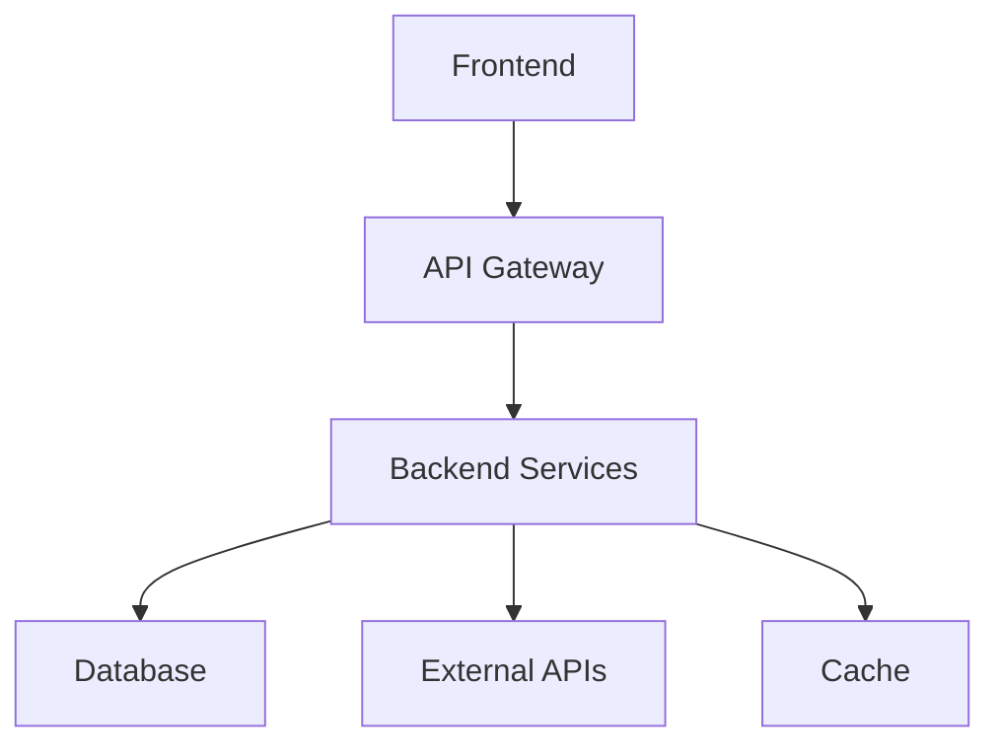

# Implementation Plan: {{PROJECT_NAME}}

{{DESCRIPTION}}

## Architecture Overview
### System Design


### Component Architecture
#### Frontend Components
- **{{FRONTEND_COMP_1}}**: {{FRONTEND_COMP_1_DESC}}
- **{{FRONTEND_COMP_2}}**: {{FRONTEND_COMP_2_DESC}}
- **{{FRONTEND_COMP_3}}**: {{FRONTEND_COMP_3_DESC}}

#### Backend Services
- **{{BACKEND_SVC_1}}**: {{BACKEND_SVC_1_DESC}}
- **{{BACKEND_SVC_2}}**: {{BACKEND_SVC_2_DESC}}
- **{{BACKEND_SVC_3}}**: {{BACKEND_SVC_3_DESC}}

#### Data Layer
- **Primary DB**: {{PRIMARY_DB_DESC}}
- **Cache Layer**: {{CACHE_DESC}}
- **File Storage**: {{STORAGE_DESC}}

## Parallel Execution Strategy

### Phase 2: Parallel Research & Analysis
**Simultaneous Research Streams:**
```
→ Backend Specialist: Server architecture, APIs, data flow analysis
→ Frontend Specialist: UI components, state management, user flows
→ Database Specialist: Schema design, query optimization, data relationships
→ Security Specialist: Security requirements, vulnerability assessment
→ Performance Specialist: Performance bottlenecks, optimization opportunities
→ Architect: Overall system design, technology validation
```

**Synchronization Points:**
- Research findings integration
- Risk assessment consolidation
- Technical constraint validation

### Phase 3: Parallel Design & Planning
**Simultaneous Design Streams:**
```
→ Architect: System architecture, technology stack, integration patterns
→ Frontend Engineer: Component architecture, UI/UX design, state management
→ Backend Engineer: API design, service architecture, data flow
→ Database Specialist: Data modeling, schema design, migration strategy
→ Security Specialist: Security architecture, authentication/authorization
→ Performance Specialist: Performance architecture, caching strategy
```

**Integration Coordination:**
- Design alignment checkpoints
- Interface definition synchronization
- Dependency conflict resolution

### Phase 4: Parallel Task Breakdown
**Domain-Specific Task Breakdown:**
```
→ Each Specialist: Break down their domain tasks
→ Planner: Map dependencies, identify critical path
→ Architect: Ensure architectural consistency
```

## Implementation Phases

### Phase 6: Parallel Implementation
#### Wave 1: Foundation (Parallel)
- **Infrastructure Setup**: DevOps specialist
- **Database Schema**: Database specialist
- **API Framework**: Backend specialist
- **UI Components**: Frontend specialist
- **Testing Framework**: Tester specialist

#### Wave 2: Core Features (Parallel)
- **Feature Implementation**: Multiple specialists by domain
- **Integration Development**: Cross-domain coordination
- **Test Development**: Parallel test creation

#### Wave 3: Integration & Quality (Parallel)
- **Integration Testing**: Tester specialist
- **Performance Testing**: Performance specialist
- **Security Testing**: Security specialist
- **Documentation**: All specialists

### Phase 7: Parallel Testing & Review
**Simultaneous Testing Streams:**
```
→ Tester: Functional testing, integration testing, test coverage
→ Security Specialist: Security testing, vulnerability scanning
→ Performance Specialist: Performance testing, load testing
→ Frontend Engineer: UI/UX testing, accessibility testing
→ Backend Engineer: API testing, endpoint validation
→ Architect: Architecture validation, design review
```

### Phase 8: Parallel Cleanup & Refactor
**Simultaneous Cleanup Streams:**
```
→ Each Specialist: Code cleanup and refactoring in their domain
→ Performance Specialist: Performance optimization
→ Security Specialist: Security improvements
→ Architect: Architectural consistency validation
```

## Conflict Detection & Management

### Resource Conflicts
#### File Conflicts
- **Risk Areas**: {{FILE_CONFLICT_AREAS}}
- **Resolution Strategy**: {{FILE_CONFLICT_RESOLUTION}}

#### Database Conflicts
- **Risk Areas**: {{DB_CONFLICT_AREAS}}
- **Resolution Strategy**: {{DB_CONFLICT_RESOLUTION}}

#### API Conflicts
- **Risk Areas**: {{API_CONFLICT_AREAS}}
- **Resolution Strategy**: {{API_CONFLICT_RESOLUTION}}

### Timing Conflicts
#### Task Dependencies
- **Critical Path**: {{CRITICAL_PATH}}
- **Dependency Map**: {{DEPENDENCY_MAP}}

#### Integration Points
- **Synchronization Points**: {{SYNC_POINTS}}
- **Coordination Mechanism**: {{COORDINATION_MECHANISM}}

## Technical Decisions

### Architecture Decisions
| Decision | Rationale | Alternatives | Trade-offs |
|----------|-----------|--------------|------------|
| {{ARCH_DECISION_1}} | {{ARCH_DECISION_1_RATIONALE}} | {{ARCH_DECISION_1_ALTERNATIVES}} | {{ARCH_DECISION_1_TRADEOFFS}} |
| {{ARCH_DECISION_2}} | {{ARCH_DECISION_2_RATIONALE}} | {{ARCH_DECISION_2_ALTERNATIVES}} | {{ARCH_DECISION_2_TRADEOFFS}} |

### Technology Choices
- **Frontend**: {{FRONTEND_TECH}} - {{FRONTEND_RATIONALE}}
- **Backend**: {{BACKEND_TECH}} - {{BACKEND_RATIONALE}}
- **Database**: {{DATABASE_TECH}} - {{DATABASE_RATIONALE}}
- **Infrastructure**: {{INFRA_TECH}} - {{INFRA_RATIONALE}}

## Testing Strategy

### Test-Driven Development (TDD)
#### Unit Tests
- **Target Coverage**: {{UNIT_TEST_COVERAGE}}%
- **Framework**: {{UNIT_TEST_FRAMEWORK}}
- **Key Areas**: {{UNIT_TEST_AREAS}}

#### Integration Tests
- **Scope**: {{INTEGRATION_TEST_SCOPE}}
- **Framework**: {{INTEGRATION_TEST_FRAMEWORK}}
- **Test Scenarios**: {{INTEGRATION_TEST_SCENARIOS}}

#### End-to-End Tests
- **Scenarios**: {{E2E_TEST_SCENARIOS}}
- **Framework**: {{E2E_TEST_FRAMEWORK}}
- **Environment**: {{E2E_TEST_ENV}}

### Quality Gates
- **Code Coverage**: ≥ {{TEST_COVERAGE_TARGET}}%
- **Performance**: < {{PERF_TARGET}}ms response time
- **Security**: No critical vulnerabilities
- **Documentation**: 100% API coverage

## Risk Management

### Failure Scenarios
#### Scenario 1: {{FAILURE_SCENARIO_1}}
- **Trigger**: {{FAILURE_1_TRIGGER}}
- **Impact**: {{FAILURE_1_IMPACT}}
- **Recovery**: {{FAILURE_1_RECOVERY}}
- **Prevention**: {{FAILURE_1_PREVENTION}}

#### Scenario 2: {{FAILURE_SCENARIO_2}}
- **Trigger**: {{FAILURE_2_TRIGGER}}
- **Impact**: {{FAILURE_2_IMPACT}}
- **Recovery**: {{FAILURE_2_RECOVERY}}
- **Prevention**: {{FAILURE_2_PREVENTION}}

## Success Metrics
### Technical Metrics
- **Performance**: {{PERFORMANCE_METRICS}}
- **Reliability**: {{RELIABILITY_METRICS}}
- **Security**: {{SECURITY_METRICS}}
- **Maintainability**: {{MAINTAINABILITY_METRICS}}

### Quality Metrics
- **Code Quality**: {{CODE_QUALITY_METRICS}}
- **Test Coverage**: {{COVERAGE_METRICS}}
- **Documentation**: {{DOC_METRICS}}

---

**Last Updated**: {{LAST_UPDATED}}
**Phase**: 3: PLAN & DESIGN