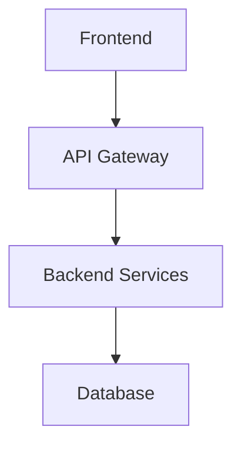

# Implementation Plan: {{PROJECT_NAME}}

{{DESCRIPTION}}

## Architecture Overview
(Add mermaid diagram or description of system architecture)

## Component Architecture

### Frontend Components
(List and describe frontend components)

### Backend Services
(List and describe backend services)

### Data Layer
(Describe database, cache, storage)

## Integration Points

### Internal
- **Component Communication**: (describe)
- **Data Flow**: (describe)
- **Service Coordination**: (describe)

### External
- **Third-party APIs**: (list)
- **Payment Gateways**: (if applicable)
- **Authentication Services**: (describe)

## Design Conflicts & Resolutions
(Document any conflicts found and how they were resolved)

## Technical Decisions

### Architecture Decisions
| Decision | Rationale | Trade-offs |
|----------|-----------|------------|
| (Decision 1) | (Why) | (What we gave up) |
| (Decision 2) | (Why) | (What we gave up) |

### Technology Choices
- **Frontend**: (technology) - (rationale)
- **Backend**: (technology) - (rationale)
- **Database**: (technology) - (rationale)
- **Infrastructure**: (technology) - (rationale)

## Task Categories
(Will be filled during Phase 4)

## Critical Path
(Will be identified during Phase 4)

## Deployment Strategy
- **Staging**: (describe)
- **Production**: (describe)
- **Monitoring**: (describe)

## Completion Checklist
- [ ] Design conflicts resolved
- [ ] Integration points identified
- [ ] Architecture decisions documented
- [ ] Technical feasibility validated
