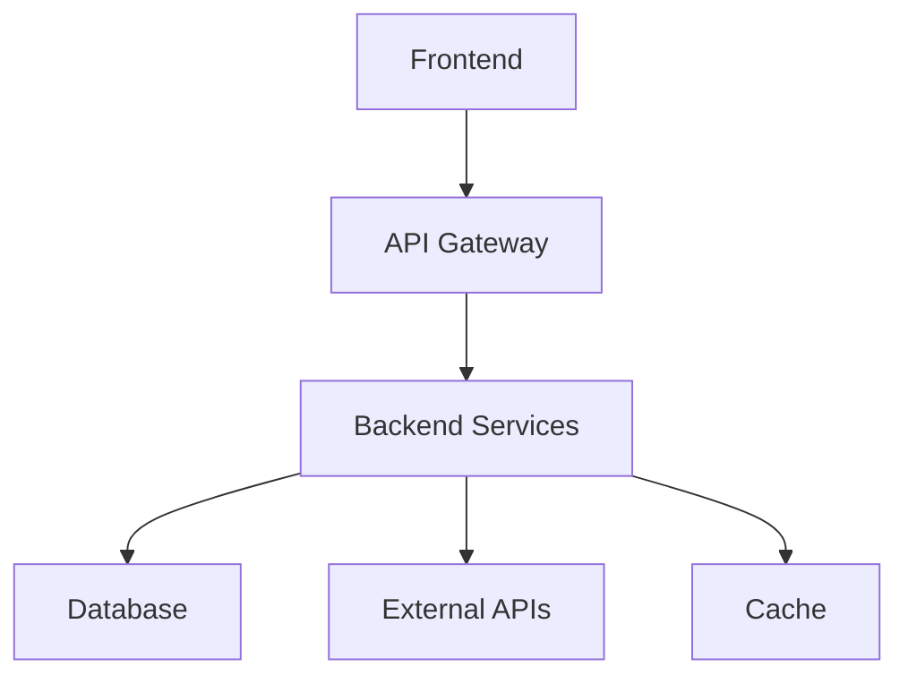

# Implementation Plan: {{PROJECT_NAME}}

{{DESCRIPTION}}

## Architecture Overview

## Component Architecture

### Frontend Components
- **{{FRONTEND_COMP_1}}**: {{FRONTEND_COMP_1_DESC}}
- **{{FRONTEND_COMP_2}}**: {{FRONTEND_COMP_2_DESC}}
- **{{FRONTEND_COMP_3}}**: {{FRONTEND_COMP_3_DESC}}

### Backend Services
- **{{BACKEND_SVC_1}}**: {{BACKEND_SVC_1_DESC}}
- **{{BACKEND_SVC_2}}**: {{BACKEND_SVC_2_DESC}}
- **{{BACKEND_SVC_3}}**: {{BACKEND_SVC_3_DESC}}

### Data Layer
- **Primary DB**: {{PRIMARY_DB_DESC}}
- **Cache Layer**: {{CACHE_DESC}}
- **File Storage**: {{STORAGE_DESC}}

## Integration Points

### Internal
- **Component Communication**: {{INTERNAL_INTEGRATION}}
- **Data Flow**: {{DATA_FLOW_STRATEGY}}
- **Service Coordination**: {{SERVICE_COORDINATION}}

### External
- **Third-party APIs**: {{EXTERNAL_APIS}}
- **Payment Gateways**: {{PAYMENT_INTEGRATION}}
- **Authentication Services**: {{AUTH_INTEGRATION}}

## Design Conflicts & Resolutions
{{#each DESIGN_CONFLICTS}}
- **{{this.conflict}}** → {{this.resolution}}
{{/each}}

## Technical Decisions

### Architecture Decisions
| Decision | Rationale | Trade-offs |
|----------|-----------|------------|
| {{ARCH_DECISION_1}} | {{ARCH_DECISION_1_RATIONALE}} | {{ARCH_DECISION_1_TRADEOFFS}} |
| {{ARCH_DECISION_2}} | {{ARCH_DECISION_2_RATIONALE}} | {{ARCH_DECISION_2_TRADEOFFS}} |

### Technology Choices
- **Frontend**: {{FRONTEND_TECH}} - {{FRONTEND_RATIONALE}}
- **Backend**: {{BACKEND_TECH}} - {{BACKEND_RATIONALE}}
- **Database**: {{DATABASE_TECH}} - {{DATABASE_RATIONALE}}
- **Infrastructure**: {{INFRA_TECH}} - {{INFRA_RATIONALE}}

## Task Categories
{{#each TASK_CATEGORIES}}
- **{{this.category}}**: {{this.description}}
{{/each}}

## Critical Path
{{#each CRITICAL_PATH}}
- **{{this.task}}** - Dependencies: {{this.prerequisites}}
{{/each}}

## Deployment Strategy
- **Staging**: {{STAGING_STRATEGY}}
- **Production**: {{PRODUCTION_STRATEGY}}
- **Monitoring**: {{MONITORING_STRATEGY}}

## Completion Status
- [ ] Design conflicts resolved
- [ ] Integration points identified
- [ ] Architecture decisions documented
- [ ] Technical feasibility validated

**Status**: {{COMPLETION_STATUS}}
