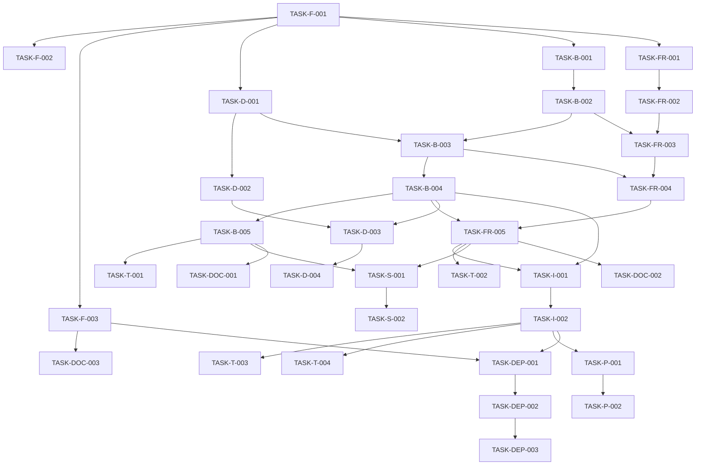

# Implementation Tasks: {{PROJECT_NAME}}

{{DESCRIPTION}}

## 🚀 Parallel Execution Strategy

### Dependency Analysis
- **Critical Path**: {{CRITICAL_PATH}}
- **Parallel Opportunities**: {{PARALLEL_OPPORTUNITIES}}
- **Resource Conflicts**: {{RESOURCE_CONFLICTS}}
- **Integration Points**: {{INTEGRATION_POINTS}}

## Wave 1: Foundation Tasks (Can run simultaneously)

### Infrastructure & Setup
- [ ] **TASK-F-001**: Setup project structure and configuration
  - **Owner**: DevOps Engineer
  - **Priority**: High
  - **Dependencies**: None
  - **Deliverable**: Project scaffold with build configs
  - **Estimated**: {{F_001_ESTIMATE}} hours

- [ ] **TASK-F-002**: Setup development environment and tooling
  - **Owner**: DevOps Engineer
  - **Priority**: High
  - **Dependencies**: TASK-F-001
  - **Deliverable**: Development environment setup
  - **Estimated**: {{F_002_ESTIMATE}} hours

- [ ] **TASK-F-003**: Setup testing framework and CI/CD pipeline
  - **Owner**: DevOps Engineer
  - **Priority**: High
  - **Dependencies**: TASK-F-001
  - **Deliverable**: Test infrastructure and CI/CD pipeline
  - **Estimated**: {{F_003_ESTIMATE}} hours

### Database Foundation
- [ ] **TASK-D-001**: Create database schema and migrations
  - **Owner**: Database Specialist
  - **Priority**: High
  - **Dependencies**: TASK-F-001
  - **Deliverable**: Database schema with migration scripts
  - **Estimated**: {{D_001_ESTIMATE}} hours

- [ ] **TASK-D-002**: Setup database connection and access layer
  - **Owner**: Database Specialist
  - **Priority**: High
  - **Dependencies**: TASK-D-001
  - **Deliverable**: Database access components and connection pool
  - **Estimated**: {{D_002_ESTIMATE}} hours

### Backend Foundation
- [ ] **TASK-B-001**: Setup backend project structure and core services
  - **Owner**: Backend Engineer
  - **Priority**: High
  - **Dependencies**: TASK-F-001, TASK-D-002
  - **Deliverable**: Backend scaffold with core service structure
  - **Estimated**: {{B_001_ESTIMATE}} hours

- [ ] **TASK-B-002**: Implement authentication and authorization middleware
  - **Owner**: Backend Engineer
  - **Priority**: High
  - **Dependencies**: TASK-B-001, TASK-D-001
  - **Deliverable**: JWT authentication middleware and authorization service
  - **Estimated**: {{B_002_ESTIMATE}} hours

### Frontend Foundation
- [ ] **TASK-FR-001**: Setup frontend project structure and routing
  - **Owner**: Frontend Engineer
  - **Priority**: High
  - **Dependencies**: TASK-F-001
  - **Deliverable**: Frontend scaffold with routing configuration
  - **Estimated**: {{FR_001_ESTIMATE}} hours

- [ ] **TASK-FR-002**: Create core UI components and design system
  - **Owner**: Frontend Engineer
  - **Priority**: High
  - **Dependencies**: TASK-FR-001
  - **Deliverable**: Core component library and design tokens
  - **Estimated**: {{FR_002_ESTIMATE}} hours

## Wave 2: Core Feature Implementation (Can run simultaneously)

### Backend Features
- [ ] **TASK-B-003**: Implement user management API endpoints
  - **Owner**: Backend Engineer
  - **Priority**: High
  - **Dependencies**: TASK-B-002, TASK-D-001
  - **Deliverable**: User CRUD API endpoints
  - **Estimated**: {{B_003_ESTIMATE}} hours

- [ ] **TASK-B-004**: Implement core business logic APIs
  - **Owner**: Backend Engineer
  - **Priority**: High
  - **Dependencies**: TASK-B-003
  - **Deliverable**: Core business logic API endpoints
  - **Estimated**: {{B_004_ESTIMATE}} hours

- [ ] **TASK-B-005**: Implement data validation and error handling
  - **Owner**: Backend Engineer
  - **Priority**: Medium
  - **Dependencies**: TASK-B-004
  - **Deliverable**: Input validation middleware and error handlers
  - **Estimated**: {{B_005_ESTIMATE}} hours

### Frontend Features
- [ ] **TASK-FR-003**: Implement authentication UI components
  - **Owner**: Frontend Engineer
  - **Priority**: High
  - **Dependencies**: TASK-FR-002, TASK-B-002
  - **Deliverable**: Login, register, and password reset forms
  - **Estimated**: {{FR_003_ESTIMATE}} hours

- [ ] **TASK-FR-004**: Implement user dashboard and navigation
  - **Owner**: Frontend Engineer
  - **Priority**: High
  - **Dependencies**: TASK-FR-003, TASK-B-003
  - **Deliverable**: User dashboard with navigation components
  - **Estimated**: {{FR_004_ESTIMATE}} hours

- [ ] **TASK-FR-005**: Implement core feature UI components
  - **Owner**: Frontend Engineer
  - **Priority**: High
  - **Dependencies**: TASK-FR-004, TASK-B-004
  - **Deliverable**: Core feature UI components and pages
  - **Estimated**: {{FR_005_ESTIMATE}} hours

### Database Features
- [ ] **TASK-D-003**: Implement database indexes and optimization
  - **Owner**: Database Specialist
  - **Priority**: Medium
  - **Dependencies**: TASK-D-002, TASK-B-004
  - **Deliverable**: Database indexes and query optimization
  - **Estimated**: {{D_003_ESTIMATE}} hours

- [ ] **TASK-D-004**: Implement data seeding and test data setup
  - **Owner**: Database Specialist
  - **Priority**: Medium
  - **Dependencies**: TASK-D-003
  - **Deliverable**: Database seeding scripts and test data
  - **Estimated**: {{D_004_ESTIMATE}} hours

## Wave 3: Integration & Testing (Dependent on Wave 2)

### Integration Tasks
- [ ] **TASK-I-001**: Integrate frontend with backend APIs
  - **Owner**: Frontend Engineer + Backend Engineer
  - **Priority**: Critical
  - **Dependencies**: TASK-B-004, TASK-FR-005
  - **Deliverable**: Full frontend-backend integration
  - **Estimated**: {{I_001_ESTIMATE}} hours
  - **Integration Points**: API endpoints, authentication flow, data binding

- [ ] **TASK-I-002**: Implement end-to-end user flows
  - **Owner**: Frontend Engineer + Backend Engineer
  - **Priority**: High
  - **Dependencies**: TASK-I-001
  - **Deliverable**: Complete user journey implementation
  - **Estimated**: {{I_002_ESTIMATE}} hours

### Testing Tasks
- [ ] **TASK-T-001**: Write unit tests for backend services
  - **Owner**: Tester + Backend Engineer
  - **Priority**: High
  - **Dependencies**: TASK-B-005
  - **Deliverable**: Backend unit test suite
  - **Estimated**: {{T_001_ESTIMATE}} hours

- [ ] **TASK-T-002**: Write unit tests for frontend components
  - **Owner**: Tester + Frontend Engineer
  - **Priority**: High
  - **Dependencies**: TASK-FR-005
  - **Deliverable**: Frontend unit test suite
  - **Estimated**: {{T_002_ESTIMATE}} hours

- [ ] **TASK-T-003**: Write integration tests
  - **Owner**: Tester
  - **Priority**: High
  - **Dependencies**: TASK-I-002
  - **Deliverable**: Integration test suite
  - **Estimated**: {{T_003_ESTIMATE}} hours

- [ ] **TASK-T-004**: Write end-to-end tests
  - **Owner**: Tester
  - **Priority**: Medium
  - **Dependencies**: TASK-I-002
  - **Deliverable**: E2E test suite
  - **Estimated**: {{T_004_ESTIMATE}} hours

### Security Tasks
- [ ] **TASK-S-001**: Implement security hardening
  - **Owner**: Security Specialist
  - **Priority**: High
  - **Dependencies**: TASK-B-005, TASK-FR-005
  - **Deliverable**: Security configurations and hardening
  - **Estimated**: {{S_001_ESTIMATE}} hours

- [ ] **TASK-S-002**: Conduct security audit and vulnerability assessment
  - **Owner**: Security Specialist
  - **Priority**: High
  - **Dependencies**: TASK-S-001
  - **Deliverable**: Security audit report and fixes
  - **Estimated**: {{S_002_ESTIMATE}} hours

### Performance Tasks
- [ ] **TASK-P-001**: Implement performance optimizations
  - **Owner**: Performance Specialist
  - **Priority**: Medium
  - **Dependencies**: TASK-I-002
  - **Deliverable**: Performance improvements and optimizations
  - **Estimated**: {{P_001_ESTIMATE}} hours

- [ ] **TASK-P-002**: Conduct performance testing and benchmarking
  - **Owner**: Performance Specialist
  - **Priority**: Medium
  - **Dependencies**: TASK-P-001
  - **Deliverable**: Performance test results and benchmarks
  - **Estimated**: {{P_002_ESTIMATE}} hours

## Wave 4: Documentation & Deployment

### Documentation Tasks
- [ ] **TASK-DOC-001**: Write API documentation
  - **Owner**: Backend Engineer + Technical Writer
  - **Priority**: Medium
  - **Dependencies**: TASK-B-005
  - **Deliverable**: Complete API documentation
  - **Estimated**: {{DOC_001_ESTIMATE}} hours

- [ ] **TASK-DOC-002**: Write user documentation and guides
  - **Owner**: Frontend Engineer + Technical Writer
  - **Priority**: Medium
  - **Dependencies**: TASK-FR-005
  - **Deliverable**: User documentation and guides
  - **Estimated**: {{DOC_002_ESTIMATE}} hours

- [ ] **TASK-DOC-003**: Write deployment and operations documentation
  - **Owner**: DevOps Engineer + Technical Writer
  - **Priority**: Medium
  - **Dependencies**: TASK-F-003
  - **Deliverable**: Deployment and operations documentation
  - **Estimated**: {{DOC_003_ESTIMATE}} hours

### Deployment Tasks
- [ ] **TASK-DEP-001**: Setup staging environment
  - **Owner**: DevOps Engineer
  - **Priority**: High
  - **Dependencies**: TASK-F-003, TASK-I-002
  - **Deliverable**: Staging environment deployment
  - **Estimated**: {{DEP_001_ESTIMATE}} hours

- [ ] **TASK-DEP-002**: Deploy to staging and conduct staging tests
  - **Owner**: DevOps Engineer + Tester
  - **Priority**: High
  - **Dependencies**: TASK-DEP-001
  - **Deliverable**: Staging deployment test results
  - **Estimated**: {{DEP_002_ESTIMATE}} hours

- [ ] **TASK-DEP-003**: Deploy to production environment
  - **Owner**: DevOps Engineer
  - **Priority**: Critical
  - **Dependencies**: TASK-DEP-002, all testing complete
  - **Deliverable**: Production deployment
  - **Estimated**: {{DEP_003_ESTIMATE}} hours
  - **Rollback Plan**: {{DEP_003_ROLLBACK_PLAN}}

## Task Dependencies Map

## 🚨 COMPLETION VERIFICATION

### Wave Completion Check
#### Wave 1 Foundation
- [ ] ALL Wave 1 tasks completed
- [ ] Infrastructure setup working
- [ ] Database schema created
- [ ] Backend scaffold ready
- [ ] Frontend scaffold ready

#### Wave 2 Core Features
- [ ] ALL Wave 2 tasks completed
- [ ] Backend APIs implemented
- [ ] Frontend components implemented
- [ ] Database optimizations applied

#### Wave 3 Integration & Testing
- [ ] ALL Wave 3 tasks completed
- [ ] Frontend-backend integration working
- [ ] All tests passing
- [ ] Security audit passed
- [ ] Performance benchmarks met

#### Wave 4 Documentation & Deployment
- [ ] ALL Wave 4 tasks completed
- [ ] Documentation complete
- [ ] Staging deployment successful
- [ ] Production deployment successful

### Final Completion Check
- [ ] ALL checkboxes above are checked
- [ ] Each task is truly complete (not just marked)
- [ ] All deliverables work as specified
- [ ] No partial work remains
- [ ] Integration tests pass
- [ ] Performance requirements met
- [ ] Security requirements satisfied
- [ ] Documentation is complete
- [ ] Ready to proceed to Phase 7: Test & Review

### Quality Gates
- [ ] Code coverage ≥ {{TEST_COVERAGE_TARGET}}%
- [ ] All tests pass (unit, integration, E2E)
- [ ] No critical security vulnerabilities
- [ ] Performance benchmarks met
- [ ] Documentation reviewed and approved
- [ ] Production deployment successful

---

**Last Updated**: {{LAST_UPDATED}}
**Total Tasks**: {{TOTAL_TASKS}}
**Estimated Total Hours**: {{TOTAL_ESTIMATED_HOURS}}