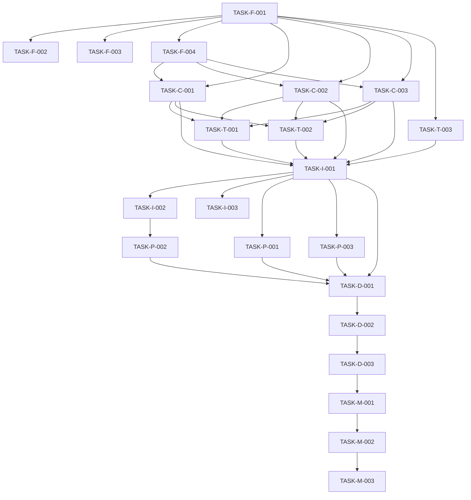

# Task Breakdown: {{PROJECT_NAME}}

{{DESCRIPTION}}

## 🚀 Parallel Execution Strategy

### Dependency Analysis
- **Critical Path**: {{CRITICAL_PATH}}
- **Parallel Opportunities**: {{PARALLEL_OPPORTUNITIES}}
- **Resource Conflicts**: {{RESOURCE_CONFLICTS}}
- **Integration Points**: {{INTEGRATION_POINTS}}

## Wave 1: Parallel Tasks (Can run simultaneously)
### Foundation Work
- [ ] **TASK-F-001**: Setup project structure and configuration
  - **Owner**: {{F_001_OWNER}}
  - **Priority**: High
  - **Dependencies**: None
  - **Deliverable**: Project scaffold with configs

- [ ] **TASK-F-002**: Create basic component templates
  - **Owner**: {{F_002_OWNER}}
  - **Priority**: High
  - **Dependencies**: TASK-F-001
  - **Deliverable**: Reusable component templates

- [ ] **TASK-F-003**: Set up testing framework
  - **Owner**: {{F_003_OWNER}}
  - **Priority**: High
  - **Dependencies**: TASK-F-001
  - **Deliverable**: Test infrastructure

- [ ] **TASK-F-004**: Initialize database schema
  - **Owner**: {{F_004_OWNER}}
  - **Priority**: High
  - **Dependencies**: TASK-F-001
  - **Deliverable**: Database schema and migrations

### Core Features - Parallel Development
- [ ] **TASK-C-001**: Implement {{FEATURE_1_NAME}}
  - **Owner**: {{C_001_OWNER}}
  - **Priority**: High
  - **Dependencies**: TASK-F-001, TASK-F-004
  - **Deliverable**: {{FEATURE_1_DELIVERABLE}}
  - **Integration Points**: {{FEATURE_1_INTEGRATION}}

- [ ] **TASK-C-002**: Implement {{FEATURE_2_NAME}}
  - **Owner**: {{C_002_OWNER}}
  - **Priority**: Medium
  - **Dependencies**: TASK-F-001, TASK-F-004
  - **Deliverable**: {{FEATURE_2_DELIVERABLE}}
  - **Integration Points**: {{FEATURE_2_INTEGRATION}}

- [ ] **TASK-C-003**: Implement {{FEATURE_3_NAME}}
  - **Owner**: {{C_003_OWNER}}
  - **Priority**: Medium
  - **Dependencies**: TASK-F-001, TASK-F-004
  - **Deliverable**: {{FEATURE_3_DELIVERABLE}}
  - **Integration Points**: {{FEATURE_3_INTEGRATION}}

### Testing & Documentation - Parallel
- [ ] **TASK-T-001**: Write unit tests for core features
  - **Owner**: {{T_001_OWNER}}
  - **Priority**: High
  - **Dependencies**: TASK-C-001, TASK-C-002, TASK-C-003
  - **Deliverable**: Unit test suite

- [ ] **TASK-T-002**: Create API documentation
  - **Owner**: {{T_002_OWNER}}
  - **Priority**: Medium
  - **Dependencies**: TASK-C-001, TASK-C-002, TASK-C-003
  - **Deliverable**: API documentation

- [ ] **TASK-T-003**: Setup CI/CD pipeline
  - **Owner**: {{T_003_OWNER}}
  - **Priority**: High
  - **Dependencies**: TASK-F-001
  - **Deliverable**: Automated deployment pipeline

## Wave 2: Dependent Tasks (After Wave 1 complete)
### Integration
- [ ] **TASK-I-001**: Integrate all components
  - **Owner**: {{I_001_OWNER}}
  - **Priority**: Critical
  - **Dependencies**: All Wave 1 tasks
  - **Deliverable**: Fully integrated system
  - **Risks**: {{I_001_RISKS}}

- [ ] **TASK-I-002**: End-to-end testing
  - **Owner**: {{I_002_OWNER}}
  - **Priority**: High
  - **Dependencies**: TASK-I-001
  - **Deliverable**: E2E test results
  - **Risks**: {{I_002_RISKS}}

- [ ] **TASK-I-003**: Performance optimization
  - **Owner**: {{I_003_OWNER}}
  - **Priority**: Medium
  - **Dependencies**: TASK-I-001
  - **Deliverable**: Performance improvements
  - **Risks**: {{I_003_RISKS}}

### Polish
- [ ] **TASK-P-001**: Code review and refactoring
  - **Owner**: {{P_001_OWNER}}
  - **Priority**: High
  - **Dependencies**: TASK-I-001
  - **Deliverable**: Clean, reviewed code

- [ ] **TASK-P-002**: Documentation completion
  - **Owner**: {{P_002_OWNER}}
  - **Priority**: Medium
  - **Dependencies**: TASK-I-002
  - **Deliverable**: Complete documentation

- [ ] **TASK-P-003**: Security audit
  - **Owner**: {{P_003_OWNER}}
  - **Priority**: High
  - **Dependencies**: TASK-I-001
  - **Deliverable**: Security audit report

## Wave 3: Final Tasks
### Deployment
- [ ] **TASK-D-001**: Deploy to staging environment
  - **Owner**: {{D_001_OWNER}}
  - **Priority**: Critical
  - **Dependencies**: All Wave 2 tasks
  - **Deliverable**: Staging deployment
  - **Rollback Plan**: {{D_001_ROLLBACK}}

- [ ] **TASK-D-002**: Final integration tests
  - **Owner**: {{D_002_OWNER}}
  - **Estimated**: {{D_002_ESTIMATE}} hours
  - **Dependencies**: TASK-D-001
  - **Deliverable**: Final test results

- [ ] **TASK-D-003**: Deploy to production
  - **Owner**: {{D_003_OWNER}}
  - **Estimated**: {{D_003_ESTIMATE}} hours
  - **Dependencies**: TASK-D-002
  - **Deliverable**: Production deployment
  - **Rollback Plan**: {{D_003_ROLLBACK}}

### Post-Deployment
- [ ] **TASK-M-001**: Monitor performance
  - **Owner**: {{M_001_OWNER}}
  - **Estimated**: {{M_001_ESTIMATE}} hours
  - **Dependencies**: TASK-D-003
  - **Deliverable**: Performance monitoring setup

- [ ] **TASK-M-002**: Address any issues
  - **Owner**: {{M_002_OWNER}}
  - **Estimated**: {{M_002_ESTIMATE}} hours
  - **Dependencies**: TASK-M-001
  - **Deliverable**: Issue resolution

- [ ] **TASK-M-003**: Document lessons learned
  - **Owner**: {{M_003_OWNER}}
  - **Estimated**: {{M_003_ESTIMATE}} hours
  - **Dependencies**: TASK-M-002
  - **Deliverable**: Lessons learned document

## 🚨 COMPLETION VERIFICATION
### Phase Completion Check
- [ ] ALL checkboxes above are checked
- [ ] Each task is truly complete (not just marked)
- [ ] All deliverables work as specified
- [ ] No partial work remains
- [ ] Integration tests pass
- [ ] Performance requirements met
- [ ] Security requirements satisfied
- [ ] Documentation is complete
- [ ] Ready to proceed to next phase

### Quality Gates
- [ ] Code coverage ≥ {{COVERAGE_TARGET}}%
- [ ] All tests pass
- [ ] No critical security vulnerabilities
- [ ] Performance benchmarks met
- [ ] Documentation reviewed and approved

## Task Dependencies Map

## Resource Allocation
### Team Members
- **{{TEAM_MEMBER_1}}**: {{TEAM_MEMBER_1_TASKS}}
- **{{TEAM_MEMBER_2}}**: {{TEAM_MEMBER_2_TASKS}}
- **{{TEAM_MEMBER_3}}**: {{TEAM_MEMBER_3_TASKS}}

### Timeline Summary
- **Wave 1 Duration**: {{WAVE_1_DURATION}} days
- **Wave 2 Duration**: {{WAVE_2_DURATION}} days
- **Wave 3 Duration**: {{WAVE_3_DURATION}} days
- **Total Duration**: {{TOTAL_DURATION}} days

## Risk Mitigation
### Task-Level Risks
- **TASK-C-001 Risk**: {{C_001_RISK}} - Mitigation: {{C_001_MITIGATION}}
- **TASK-I-001 Risk**: {{I_001_RISK}} - Mitigation: {{I_001_MITIGATION}}
- **TASK-D-003 Risk**: {{D_003_RISK}} - Mitigation: {{D_003_MITIGATION}}

### Timeline Risks
- **Risk 1**: {{TIMELINE_RISK_1}} - Mitigation: {{TIMELINE_MITIGATION_1}}
- **Risk 2**: {{TIMELINE_RISK_2}} - Mitigation: {{TIMELINE_MITIGATION_2}}

## Progress Tracking
  - **Started**: {{TASK_START_DATE}}
- **Last Updated**: {{LAST_UPDATED}}
- **Current Wave**: {{CURRENT_WAVE}}
- **Overall Progress**: {{OVERALL_PROGRESS}}%
- **Tasks Completed**: {{TASKS_COMPLETED}}/{{TOTAL_TASKS}}